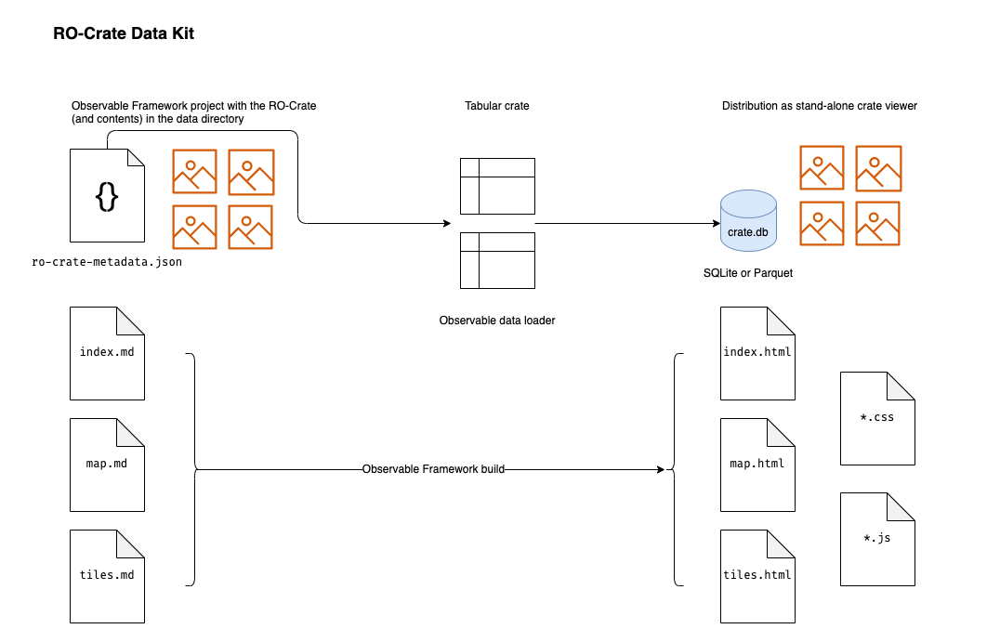

# RO-Crate Data Kit

A toolkit for making stand-alone, performant web version of a research data
collection packaged as an [RO-Crate](https://www.researchobject.org/ro-crate/1.1/), using the [Observable Framework](https://observablehq.com/framework).

The focus is on humanities collections but this should be general enough
to work with any valid RO-Crate.

## Quick start

[FIXME - this needs to include a Python dependency stage]

1. Copy this repo
2. Copy your RO-Crate into src/data/ in place of the 'crate' directory
3. npm install
4. npm run build
5. npm run dev
6. Browse to http://127.0.0.1:3000/ to explore the crate

## How it works

The data loader script crate.db.py transforms the ro-crate-metadata.json into
an SQLite database, which allows reasonable performance in the frontend.

Any file referred to in the ro-crate-metadata.json will be copied from the 
crate into the dist directory.

Each Markdown file is an Observable page giving a particular view of the crate.

## How to customise

Remove the Markdown files for pages you don't need.

If additional indices are required in the database, you can modify crate.db.py

Instructions for stylesheets etc should go here

